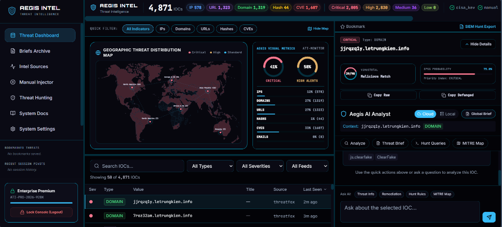
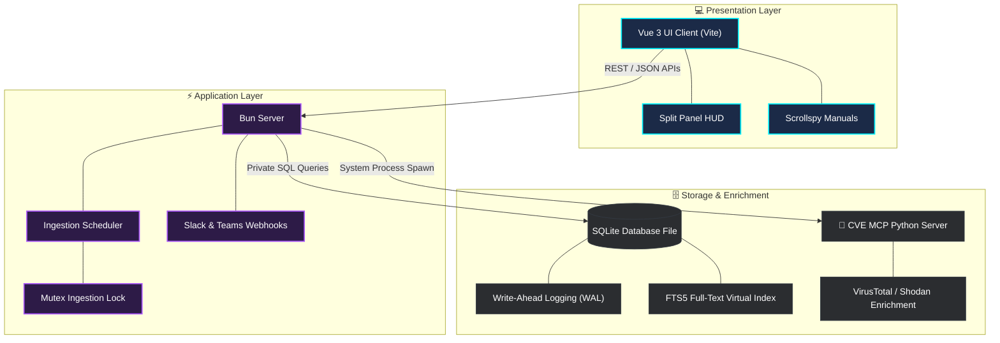

<p align="center">
  
</p>

<p align="center">
  <a href="https://bun.sh/"></a>
  <a href="https://sqlite.org/"></a>
  <a href="https://vuejs.org/"></a>
  <a href="#network-boundary--air-gapped-compliance"></a>
</p>

# Aegis Threat Intel (ATI)

**Self-Hosted, Privacy-First Threat Intelligence Platform**

Aegis Threat Intel (ATI) is a self-hosted, privacy-first threat intelligence platform (TIP) designed to ingest global intelligence feeds, correlate indicators of compromise (IOCs) locally in a high-performance SQLite database, and expose them through a cognitive AI analyst interface. ATI enables analysts to run complex queries, draft reports, and analyze technical data in plain natural language—while keeping all sensitive telemetry and search history secure on your organization's private network.

---

## Live Interactive Demo

A live interactive demo of the front-end dashboard is available at:
👉 Live Dashboard: **[aegis-threat-intel.vercel.app](https://aegis-threat-intel.vercel.app/)**

### Quick Demo Walkthrough Guide

To explore the capabilities of the Aegis HUD interface without deploying the Bun backend:

1. **Authentication (Console Login)**:
   - On the login screen, click the **⚡ Autofill Demo** button.
   - The interface will automatically type the credentials (`admin` / `SecOps-ATI-2026`) and log you in with a high-tech terminal typewriter animation.
2. **Dashboard Overview**:
   - Explore the **SVG Geographic Threat Map** depicting dynamic severity distributions across global hubs.
   - Interact with the **Aegis Visual Metrics circular gauges** computing critical alert ratios.
   - Browse, search, and filter the ingestion table containing live IOCs (IPs, CVEs, Hashes, Domains).
3. **Interactive AI Analyst**:
   - Select any IOC from the table to populate the **Threat Dossier** details panel on the right.
   - Toggle **`[Hide Details]` / `[Show Details]`** to dynamically expand the AI Analyst chat history.
   - Ask the AI analyst questions or use the **Global Brief** button to run simulated briefs. Note that in this public serverless demo, the AI operates in its high-fidelity rule-based **Demo Mode** fallback simulator.
4. **Dialect Detection & Signatures**:
   - Go to the **Threat Hunting** tab to view pre-packaged detections for critical vulnerabilities (Log4Shell, etc.).
   - Toggle between **Splunk SPL**, **Azure KQL**, and **Sigma (YAML)** syntax formats.
5. **System Documentation & FAQ**:
   - View the scrollspy-powered **System Docs** tab or click the **FAQ** panel in the sidebar to test searchable accordions.

---

## Table of Contents

1. [Live Interactive Demo](#live-interactive-demo)
2. [Platform Capabilities](#platform-capabilities)
3. [System Architecture](#system-architecture)
4. [Core Technical Specifications](#core-technical-specifications)
5. [Directory Workspace Layout](#directory-workspace-layout)
6. [Prerequisites & Development Setup](#prerequisites--development-setup)
7. [Production Deployment & Runbook](#production-deployment--runbook)
8. [System Configurations Matrix](#system-configurations-matrix)
9. [Comprehensive API Reference](#comprehensive-api-reference)
10. [Troubleshooting & Diagnostics](#troubleshooting--diagnostics)
11. [Future Roadmap](#future-roadmap)

---

## Platform Capabilities

Aegis Threat Intel helps security operations centers (SOCs) break free from external cloud dependencies for threat intelligence analysis. Modern cloud-based TIPs risk leaking internal query parameters, proprietary system logs, and sensitive security events to third-party providers. ATI operates entirely within your network boundary, offering:

- **Automated Intelligence Feed Ingestion**: Connects to and pulls daily threat telemetry from feeds including CISA Known Exploited Vulnerabilities (KEV), URLhaus, and ThreatFox.
- **Custom IOC Manual Injection**: A real-time data ingestion portal to manually catalog and describe internal threat events, indicators, or CVE identifiers.
- **Cognitive AI Analyst**: A senior threat analyst interface running context-aware queries, parsing unstructured briefs, mapping actions to the MITRE ATT&CK framework, and writing search process signatures.
- **Post-Processing Safe Defanging Engine**: An automated security filter converting active domains, URLs, and IP addresses to safe, non-navigable formats (e.g., `hxxps://`, `[.]`) in briefs, logs, and exports.
- **Data Privacy & AI Model Portability**: Toggle dynamically between secure cloud execution (Anthropic Claude API) and offline local processing (Ollama local inference) to comply with air-gapped guidelines.
- **Outbound Alerting & Webhooks**: Integrated MS Teams Adaptive Cards, Slack Markdown, and Generic JSON alerts triggered by high-severity ingest events.

---

## System Architecture

The platform utilizes a modern decoupled client-server architecture designed to run on-premises with minimum external connections.



### Decoupled Components

- **Presentation Layer (Vue 3 Client)**: Built using Vite, TypeScript, and Tailwind CSS. The interface features a flexible split-panel layout, interactive SVG threat map, dynamic charts, live settings dashboard, and a scrollspy-tracked manuals viewer.
- **Application Layer (Bun Server)**: A high-performance server running on Bun. It handles scheduler tasks, manages connection pooling, implements CORS validation patterns, exposes REST endpoints, and interfaces with AI models.
- **Storage Layer (SQLite Engine)**: Uses a local database operating in Write-Ahead Logging (WAL) mode. Full-text search capability is supported through virtual table indices built with SQLite's native FTS5 extension.
- **Enrichment Layer (CVE MCP Server)**: An optional background service written in Python that spawns as a Model Context Protocol (MCP) server, offering Claude 27 diagnostic tools (VirusTotal, GreyNoise, Shodan, crt.sh, NVD, and EPSS lookups).

---

## Core Technical Specifications

### SQLite WAL Mode & Concurrency
To ensure that hourly background ingestion routines do not block real-time analyst search requests, Aegis configures its SQLite engine with WAL journaling:
```sql
PRAGMA journal_mode=WAL;
PRAGMA busy_timeout=5000;
```
WAL mode writes transaction logs to a companion `-wal` file, letting concurrent database readers read original data pages safely while writes occur.

### Ingestion Scheduler Lock
To prevent database write contention or API rate limits, the ingestion scheduler executes inside a promise-based mutex wrapper:
```typescript
let activePollPromise: Promise<void> | null = null;
```
If a user triggers a manual ingestion while a scheduled update is running, the server registers the call and reuses the active execution context instead of launching a concurrent writer.

### SQLite FTS5 Search & Query Fallback
ATI uses a virtual index mapping title, value, tags, and description fields to speed up indicator queries:
```sql
CREATE VIRTUAL TABLE iocs_fts USING fts5(
  value, title, description, tags,
  content='iocs', content_rowid='id'
);
```
Special characters like dots (in IP addresses) or colons (in URLs) act as delimiters in SQLite's default tokenizer, which can trigger parse syntax errors during literal searches. Aegis handles this by running a try-catch fallback pattern:
1. **MATCH Phase**: Try executing an optimized query: `SELECT rowid FROM iocs_fts WHERE iocs_fts MATCH '"185.220.101[.]4"*';`
2. **LIKE Phase**: If the database throws a query parsing exception, catch the error and execute a standard wildcard fallback query: `SELECT id FROM iocs WHERE value LIKE '%185.220.101.4%' OR title LIKE '%185.220.101.4%';`

### Automated Defanging Rules
The post-processing engine sanitizes threat briefs, logs, and exports. All indicators matching IP, Domain, or URL syntax patterns are defanged:
- **Protocol Mapping**: Converts `http://` or `https://` protocols into `hxxp://` and `hxxps://`.
- **IP Address Mapping**: Replaces standard dot separators with bracketed dots, converting `198.51.100.42` to `198[.]51[.]100[.]42`.
- **Hostname Mapping**: Wraps the final dot separator in domain names in brackets, converting `malware.evil.com` to `malware.evil[.]com`.

---

## Directory Workspace Layout

```
Harbinger-main/
├── apps/
│   ├── client/                  # Vue 3 Frontend Workspace
│   │   ├── src/
│   │   │   ├── components/      # UI Elements (IOC Table, Stats, Chat, SIEM Drawer)
│   │   │   ├── composables/     # Data & AI Connection Hooks
│   │   │   ├── utils/           # HTML Sanitization & Helper Functions
│   │   │   ├── App.vue          # Core View Layout & Navigation Controls
│   │   │   └── main.ts          # Application Entry point
│   │   ├── index.html           # Main Document Template
│   │   ├── tailwind.config.js   # Style configurations & Colors
│   │   └── vite.config.ts       # Proxy & Bundle Options
│   └── server/                  # Bun API Backend Workspace
│       ├── src/
│       │   ├── ai-client.ts     # Anthropic Claude & Ollama Client Wrapper
│       │   ├── db.ts            # Database Operations, FTS5 Rebuilds, & Webhooks
│       │   ├── feeds.ts         # Automated Multi-Feed Polling Scheduler
│       │   ├── mcp-client.ts    # Model Context Protocol Spawning Code
│       │   └── index.ts         # REST Server Endpoints & Routing Logic
├── .env.example                 # Environment Configuration Blueprint
├── aegis-intel.db               # SQLite Local Storage File
├── manage.sh                    # Multi-Process Management Script
└── README.md                    # Platform Documentation
```

---

## Prerequisites & Development Setup

Before launching Aegis Threat Intel in a development environment, verify that your host system meets the following requirements:

### System Requirements
- **Operating System**: Windows 10/11, macOS 12+, or Linux (Ubuntu 22.04+).
- **Runtime Engine**: [Bun v1.1.0+](https://bun.sh/) (or Node.js v20+ with npm).
- **Database**: SQLite v3.45+ (pre-packaged within runtime environment).
- **Optional Services**:
  - Python v3.10+ (Required only if enabling `CVE_MCP` enrichment tools).
  - Ollama Daemon (Required only if running local offline model inferences).

### Local Installation Steps

1. **Clone the Repository**:
   ```bash
   git clone <repository_url> AegisIntel
   cd AegisIntel
   ```

2. **Configure Environment Variables**:
   Copy the blueprint file to initialize settings:
   ```bash
   cp .env.example .env
   ```
   Open the `.env` file and fill in the required API credentials:
   ```env
   ABUSE_CH_AUTH_KEY=your_abuse_ch_key_here
   ANTHROPIC_API_KEY=sk-ant-sid01-your-key-here
   ```

3. **Install Dependencies**:
   Install client and server dependencies using Bun:
   ```bash
   # Install server workspace modules
   cd apps/server && bun install
   
   # Install client workspace modules
   cd ../client && bun install
   ```

4. **Launch Services in Developer Mode**:
   Return to the root workspace directory and use the management helper script to start client and server instances:
   ```bash
   cd ../..
   ./manage.sh start
   ```
   *Note: On Windows systems running PowerShell, you can run the server and client in separate terminals:*
   ```bash
   # Terminal 1: Launch Backend API Server
   cd apps/server && bun run src/index.ts
   
   # Terminal 2: Launch Vite Client Server
   cd apps/client && npm run dev
   ```

5. **Verify Endpoint Accessibility**:
   Open a browser and navigate to:
   - **Vite Developer Port**: `http://localhost:5174` (Aegis security HUD).
   - **API Server Endpoint**: `http://localhost:4001/health` (Should return `{"status":"ok", ...}`).

---

## Production Deployment & Runbook

For production environments, Aegis Threat Intel should be built and served as optimized packages to ensure low latency and reduced runtime resource footprints.

### Building Frontend Assets
Generate static HTML, CSS, and JS production assets:
```bash
cd apps/client
npm run build
```
Vite compiles and minifies application files, exporting them to the `apps/client/dist` directory. These assets can then be served via Nginx or proxied through the Bun backend server.

### Deploying the Backend API
Start the server in production mode using a process manager like `pm2` to handle restarts and logging:
```bash
cd apps/server
pm2 start src/index.ts --name aegis-server --interpreter bun
```

### Running with Docker Containerization
Aegis can be containerized to run inside isolated namespaces. Set up the container using Docker Compose:

1. **Create a `Dockerfile` for the Application**:
   ```dockerfile
   FROM oven/bun:1.1-alpine
   WORKDIR /app
   COPY . .
   RUN cd apps/server && bun install
   RUN cd apps/client && bun install && npm run build
   EXPOSE 4001
   CMD ["bun", "run", "apps/server/src/index.ts"]
   ```

2. **Launch the Container Stack**:
   ```bash
   docker-compose up -d --build
   ```

---

## System Configurations Matrix

Aegis reads settings from environment variables populated in the `.env` file at the project root.

| Variable Name | Type | Scope | Security Level | Default Value | Technical Purpose & Behavior |
| :--- | :--- | :--- | :--- | :--- | :--- |
| `PORT` | Numeric | Server | System | `4001` | Sets the port for the Bun HTTP backend server. |
| `CLIENT_PORT` | Numeric | Server | System | `5174` | Whitelists custom Vue frontend client origins in CORS headers. |
| `DB_PATH` | File Path | Server | System | `./aegis-intel.db` | Sets the path to the local SQLite database. |
| `POLL_INTERVAL_MS` | Numeric | Server | Ingestion | `3600000` | Feed ingestion timer interval (in milliseconds). Default: 1 hour. |
| `ABUSE_CH_AUTH_KEY` | String | Server | Credentials | `""` (Empty) | API key for Abuse.ch, required for polling URLhaus and ThreatFox. |
| `ANTHROPIC_API_KEY` | String | Server | Credentials | `""` (Empty) | API key for Anthropic, required to unlock Claude Cloud Mode. |
| `CVE_MCP_ENABLED` | Boolean | Server | MCP Module | `true` | Toggles background spawning of the companion Python MCP client. |
| `CVE_MCP_PYTHON` | File Path | Server | System | `""` (Empty) | Absolute path to the Python executable within the CVE MCP virtual environment. |
| `CVE_MCP_CWD` | Directory | Server | System | `""` (Empty) | Absolute directory path where the CVE MCP server codebase is located. |

---

## Comprehensive API Reference

Aegis uses standard REST HTTP endpoints. Response bodies are returned in JSON format.

### Security Headers
All endpoints return CORS headers restricted to whitelisted frontend client origins:
- `Access-Control-Allow-Origin`: `http://localhost:5174` (or configured client ports)
- `Access-Control-Allow-Methods`: `GET, POST, OPTIONS`
- `Access-Control-Allow-Headers`: `Content-Type`

---

### Endpoint Catalog

#### 1. System Health Status
- **Method & Path**: `GET /health`
- **Description**: Verifies API backend health, local database status, and active feed counts.
- **Request Parameters**: None.
- **Success Response (200 OK)**:
  ```json
  {
    "status": "ok",
    "timestamp": 1780216838000,
    "iocCount": 1609,
    "feedCount": 4
  }
  ```

#### 2. System-Wide Ingestion Statistics
- **Method & Path**: `GET /stats`
- **Description**: Returns statistics for stored indicators, grouping counts by severity, type, and source feed.
- **Request Parameters**: None.
- **Success Response (200 OK)**:
  ```json
  {
    "totalIOCs": 1609,
    "bySeverity": {
      "critical": 142,
      "high": 318,
      "medium": 810,
      "low": 339
    },
    "byType": {
      "ip": 450,
      "domain": 620,
      "url": 310,
      "hash": 200,
      "cve": 29
    },
    "byFeed": {
      "cisa_kev": 29,
      "urlhaus": 310,
      "threatfox": 1120,
      "manual": 150
    }
  }
  ```

#### 3. List Ingestion Feeds
- **Method & Path**: `GET /feeds`
- **Description**: Lists configured external threat feeds, including their status and last poll metrics.
- **Request Parameters**: None.
- **Success Response (200 OK)**:
  ```json
  [
    {
      "id": 1,
      "name": "cisa_kev",
      "url": "https://www.cisa.gov/sites/default/files/feeds/known_exploited_vulnerabilities.json",
      "status": "ok",
      "last_poll": 1780213975000,
      "last_count": 2,
      "error_msg": null
    }
  ]
  ```

#### 4. Trigger Feed Ingestion
- **Method & Path**: `POST /feeds/poll`
- **Description**: Triggers background polling across all external threat feeds. This endpoint uses a scheduler lock to prevent concurrent database writes.
- **Request Parameters**: None.
- **Success Response (200 OK)**:
  ```json
  {
    "triggered": true,
    "message": "Poll started"
  }
  ```

#### 5. Search Threat Indicators (POST method)
- **Method & Path**: `POST /iocs/search`
- **Description**: Performs a search query across indicators, with support for type, severity, and feed source filters.
- **Request Body**:
  ```json
  {
    "query": "185.220.101",
    "type": "ip",
    "severity": "critical",
    "limit": 10
  }
  ```
- **Success Response (200 OK)**:
  ```json
  {
    "iocs": [
      {
        "id": 421,
        "feed_id": 3,
        "ioc_type": "ip",
        "value": "185.220.101.4",
        "severity": "critical",
        "title": "Tor Exit Node Match",
        "description": "Active malicious scanner identified by ThreatFox feed.",
        "first_seen": 1780196614000,
        "last_seen": 1780215929000,
        "tags": "[\"tor\", \"scanner\"]"
      }
    ],
    "total": 1
  }
  ```

#### 6. Custom Indicator Manual Ingest
- **Method & Path**: `POST /iocs/custom`
- **Description**: Ingests a single custom security indicator into the local database (assigned to the `manual` feed source) and triggers outbound webhook alerts if its severity is high or critical.
- **Request Body**:
  ```json
  {
    "ioc_type": "ip",
    "value": "198.51.100.42",
    "severity": "critical",
    "title": "Internal Probe Alert",
    "description": "Detected reconnaissance scanning against server subnets.",
    "source_ref": "https://internal.wiki/incident-928",
    "tags": "recon, probe, scan"
  }
  ```
- **Success Response (200 OK)**:
  ```json
  {
    "success": true,
    "message": "IOC added successfully"
  }
  ```

#### 7. Bulk Indicator Ingest
- **Method & Path**: `POST /iocs/bulk`
- **Description**: Ingests an array of threat indicators in a single database transaction. Outbound alerts are sent asynchronously for indicators rated High or Critical.
- **Request Body**:
  ```json
  {
    "indicators": [
      {
        "ioc_type": "domain",
        "value": "phishing.evil-domain.com",
        "severity": "high",
        "title": "Credential Harvest Page",
        "tags": ["phish", "bulk"]
      }
    ]
  }
  ```
- **Success Response (200 OK)**:
  ```json
  {
    "success": true,
    "count": 1,
    "message": "Successfully injected 1 indicators"
  }
  ```

#### 8. Retrieve Integration Settings
- **Method & Path**: `GET /settings`
- **Description**: Returns configured Slack, Teams, and generic webhook integration URLs. URL paths containing sensitive credentials are masked with placeholder characters.
- **Request Parameters**: None.
- **Success Response (200 OK)**:
  ```json
  {
    "success": true,
    "settings": {
      "slack_webhook_url": "https://hooks.slack.com/services/T***/***/******",
      "teams_webhook_url": "https://outlook.office.com/webhook/***",
      "generic_webhook_url": "http://localhost:4001/api/mock-webhook/generic"
    }
  }
  ```

#### 9. Update Integration Settings
- **Method & Path**: `POST /settings`
- **Description**: Updates Slack, Teams, or generic webhook integration settings. Masked URL parameters containing placeholder characters (e.g. `***`) are ignored by the server to prevent overwriting stored credentials.
- **Request Body**:
  ```json
  {
    "settings": {
      "slack_webhook_url": "https://hooks.slack.com/services/T0123/B456/KeyStructure",
      "teams_webhook_url": null
    }
  }
  ```
- **Success Response (200 OK)**:
  ```json
  {
    "success": true,
    "message": "Settings saved successfully"
  }
  ```

#### 10. Webhook Connection Integration Test
- **Method & Path**: `POST /api/webhooks/test`
- **Description**: Dispatches a test notification payload to verify webhook connectivity. If the input URL contains mask placeholders (e.g., `***`), the server unmasks it using the credentials stored in the system database.
- **Request Body**:
  ```json
  {
    "webhook_type": "slack",
    "url": "https://hooks.slack.com/services/T***/***/******"
  }
  ```
- **Success Response (200 OK)**:
  ```json
  {
    "success": true,
    "status": 200,
    "statusText": "OK"
  }
  ```

#### 11. Submit Interactive AI Analyst Query
- **Method & Path**: `POST /chat`
- **Description**: Sends a natural language query to the AI Analyst (routed to Claude or a local Ollama model). You can optionally provide a list of threat records in `iocContext` to give the AI context about the active case.
- **Request Body**:
  ```json
  {
    "message": "Write a detection signature for this indicator.",
    "history": [
      { "role": "user", "content": "Analyze Tor scanner activities." },
      { "role": "assistant", "content": "Analysis details..." }
    ],
    "iocContext": [
      {
        "ioc_type": "ip",
        "value": "185.220.101.4",
        "severity": "critical"
      }
    ],
    "provider": "anthropic"
  }
  ```
- **Success Response (200 OK)**:
  ```json
  {
    "success": true,
    "response": "Here is a Splunk search signature to detect traffic matching IP 185[.]220[.]101[.]4...",
    "history": [...]
  }
  ```

---

## Troubleshooting & Diagnostics

ATI includes several diagnostic and fallback mechanisms to ensure high availability and prevent search or indexing errors.

### 1. SQLite Database Locks (`SQLITE_BUSY: database is locked`)
- **Root Cause**: Occurs when multiple write operations run concurrently or when a thread holds an open write transaction for too long.
- **Resolution Path**:
  1. Confirm that WAL mode is enabled:
     ```bash
     sqlite3 aegis-intel.db "PRAGMA journal_mode;"
     ```
     Should return `wal`. If it returns `delete`, run:
     ```bash
     sqlite3 aegis-intel.db "PRAGMA journal_mode=WAL;"
     ```
  2. The server configuration includes a busy timeout fallback:
     ```typescript
     db.run('PRAGMA busy_timeout = 5000;');
     ```
     This instructs the engine to wait up to 5 seconds for write locks to clear before raising a connection error.
  3. Ensure that background ingestion tasks run inside the scheduler lock wrapper to prevent concurrent execution.

### 2. CORS Policy Errors
- **Root Cause**: Occurs when the web browser blocks requests because the client and server ports differ.
- **Resolution Path**:
  Verify the whitelisted client port in your `.env` configuration:
  ```env
  CLIENT_PORT=5174
  ```
  Aegis dynamically generates `Access-Control-Allow-Origin` values by matching incoming request headers against whitelisted origins.

### 3. Local Offline Models Unreachable
- **Root Cause**: Occurs when the server is set to Local Mode (`Ollama`) but the Ollama service is stopped, or the selected model is not downloaded.
- **Resolution Path**:
  1. Confirm the Ollama service is running on the host system:
     ```bash
     curl http://localhost:11434/api/tags
     ```
     This should return a list of downloaded models.
  2. Download the required model using the command-line interface:
     ```bash
     ollama pull llama3.1
     ```
  3. Verify the configured endpoint and model settings in the **System Settings** dashboard.

### 4. CVE MCP Spawning Failure
- **Root Cause**: Occurs when the server is set to Claude Cloud Mode and attempts to spawn the Python MCP client, but the Python path or directory settings are incorrect.
- **Resolution Path**:
  1. Verify the configured paths in the `.env` settings:
     ```env
     CVE_MCP_PYTHON=C:\Users\Name\cve-mcp-server\.venv\Scripts\python.exe
     CVE_MCP_CWD=C:\Users\Name\cve-mcp-server
     ```
  2. Ensure the Python virtual environment has all required dependencies installed:
     ```bash
     cd C:\Users\Name\cve-mcp-server
     .venv\Scripts\pip install -r requirements.txt
     ```
  3. Check the server logs for process creation errors to identify any OS-specific path issues.

---

## Future Roadmap

To align with an evolutionary strategy of continuous adaptation and scale, the following capabilities are planned:

- **Offline LLM RAG (Retrieval-Augmented Generation)**: Expanding the Ollama fallback to ingest local PDF intelligence reports and internal SOC logs, allowing the AI to query proprietary network history without ever touching the cloud.
- **Native YARA Rule Execution Engine**: Moving beyond static IOCs (hashes/IPs) to scan local file system payloads and memory dumps against community-driven or custom YARA signatures directly from the UI.
- **STIX/TAXII 2.1 Integration**: Upgrading the ingestion scheduler to natively consume standard STIX/TAXII feeds, ensuring interoperability with government and enterprise intelligence sharing platforms.
- **Automated SOC Reporting Pipeline**: A module to snapshot the current Threat Map, top active CVEs, and AI analyst summaries, compiling them into a sterile, time-stamped PDF for executive debriefs.
- **Multi-Tenant RBAC (Role-Based Access Control)**: Granular permissions separating Tier 1 Analysts (read-only/query) from Tier 3 Hunters (webhook configuration, database management).
- **Aegis Decoy Mesh (Autonomous Honeypot Telemetry)**: A lightweight, low-interaction decoy engine that spawns mock services (SSH, Redis, HTTP API) inside local network boundaries. The decoy logs brute-force and vulnerability scans, defangs payload strings in real-time, extracts malicious indicators (IPs, user-agents, command lines), and feeds them directly into the Aegis WAL SQLite engine to automatically trigger defensive alerting rules.
- **Privacy-Preserving P2P Intel Mesh (Zero-Knowledge Indicators)**: A decentralized sharing framework designed to exchange verified threat telemetry between trusted SOC networks. Utilizing Zero-Knowledge Proofs (ZKPs) and peer-to-peer STIX-over-Noise protocol, Aegis nodes share verified threat signatures without exposing host organization names, IP scopes, or telemetry structures to peer networks.
